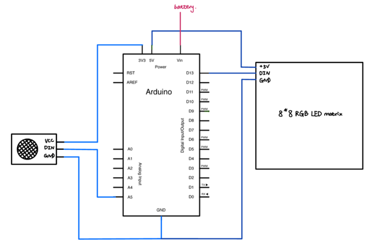
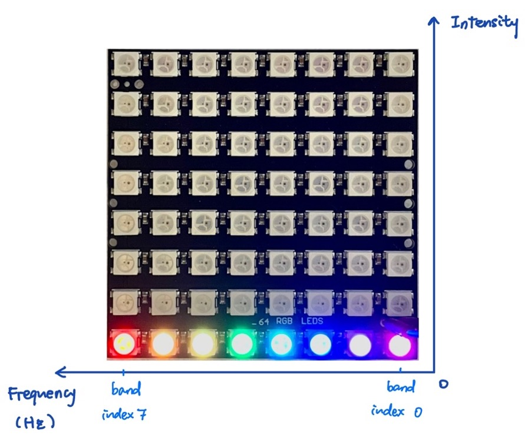

# Simple Music Visualizer with Arduino 
- Using Fourier Transform algorithm library to decompose the sound signal picked up by a microphone module into difference frequency ranges corresponding to their level of intensity.   

- Outputting the data using an 8*8 RGB LED Matrix with its x and y axis defined as frequency bands and intensity level. #initiatives & individual project
  

## Conceptualizatoin
- The concept of this project is to design a device that synchronously displays the intensity and frequency of the audio input. Through research, I learnt that the Fourier Transform algorithm can be used to realize the decomposition of a signal consisting of multiple frequencies. Using the FFT (Fast Fourier Transformation) library available in the Arduino library manager, I coded the program to extract different frequencies within an audio source and identify the intensity of each frequency level. To output this information on a LED matrix, I separated the detectable frequency range into eight subranges where each has a linear display of its intensity. When inputs of multiple frequencies are detected under one subrange, the sum of their intensities would be calculated and extracted for the display.

## Installation
- The prototype is composed of a sound sensor module, a breadboard, an 8*8 RGB LED matrix, an Arduino UNO, and a power source. When the device is in use, the sound sensor module collects audio inputs, synchronously transformed into visual outputs on the LED matrix. Columns and rows of the matrix correspondingly demonstrate 8 levels of frequencies and intensities.  

- On the matrix, the columns of colour bands represent increasing levels of frequency from right to left, indicated by a spectrum of colours from pink to red. Meanwhile, the columns' heights indicate their intensity levels, where taller colour bands signify higher intensities in the corresponding frequency.
  

  

## Demo
https://user-images.githubusercontent.com/122344784/211725169-aae79129-c511-4b0c-8b2b-65e6fb0ceae1.mp4

## Evaluation
- This project yeilds satisfactory outcomes as the LED matrix does provide a adequat visualization the music signal. By adjusting the frequency bands, I can visually distinguish between different musical components of a song by their frequency ranges. For instance, the pink and purple columns of the LED matrix almost exclusively display the basses and the drumbeats, which occupy the lowest pitches in a song. Meanwhile, the vocal and instrumental sounds predominantly occupy the orange and the blue columns, sometimes reaching the red column if the melody incorporates a high note.
- However, this project also has its imperfections. Firstly, the sound sensor module picks up the electrolytic noises of the LED matrix due to its high sensitivity and its proximity to the matrix. I have yet to find an ideal solution to the former issue, and the current fix of turning down the sensor sensitivity and increasing the noise filter results in the visualizer’s dullness in reaction to low volumes. Meanwhile, the latter issue remains outstanding as the distance between the two components is limited by the length of the connecting wire. Secondly, an Arduino Uno can only stably process a maximum of 128 samples with a sampling rate of 10000 for the FFT constructor. Although a larger capacity would theoretically provide a more accurate analysis of the sound, tentative adjustments to the maximum values were unsuccessful as they brutally overloaded the dynamic memory of the Arduino Uno board. Such limitations to the capacity impose a limit on the sensibility of the device, exhibiting a slightly delayed output and loss of details to a certain extent.

## Area for Future Improvement
- If more time was allocated for this project, I would like to develop more modes of visualization and incorporate a pushbutton switch to allow alternation between the modes. 
 - If I had access to more equipment, I would use an Arduino board with greater dynamic memory capacity (e.g. Arduino Mega) to allow for greater sample input and higher sampling rates. A line-in sound sensor and a larger LED matrix could also be used to display more accurate readings. 
 - If I had the opportunity to restart this project, I would conduct more research on the Fourier Transform, the language of C++, and the FFT library prior to constructing and programming the device, aiming to work through it with greater efficiency and fewer errors. 